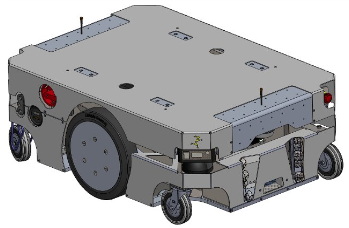
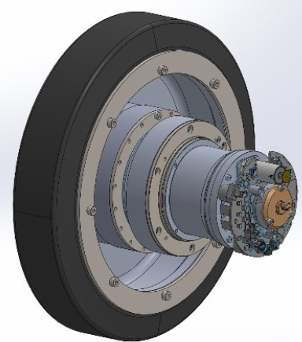
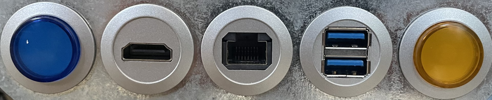
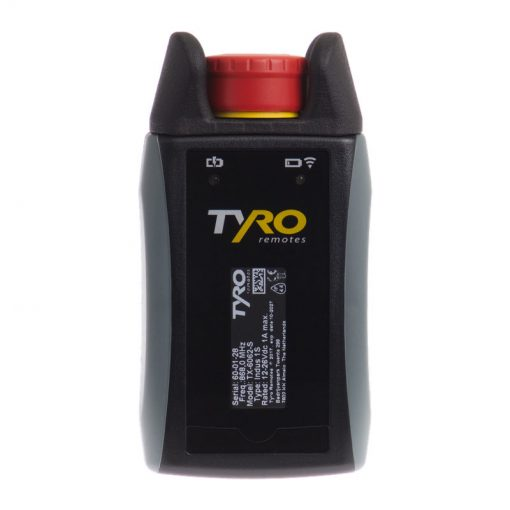
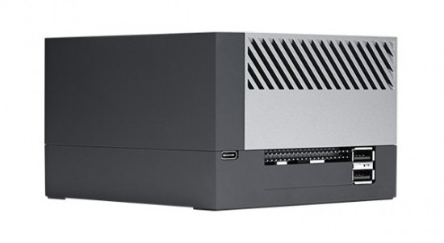
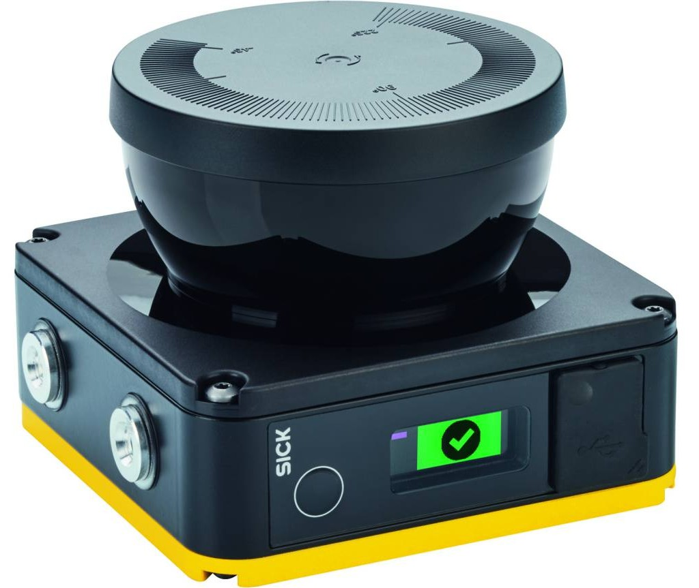

# TMR - Tactile Mobile Robot

## Quickstart

The internal user PC can be access via the provided ethernet port with the IP `172.16.1.9`. Within, you can implement, compile and run ROS 2 related code to monitor and control the full robot.

The standard IP for the mobile platform (TMR) is `172.16.1.20`.

## Table of Contents
1. [Introduction](#introduction)
2. [Hardware and Software Integration](#hardware-and-software-integration)
   - [Wheel Drive Units](#wheel-drive-units)
   - [External Ports Panel](#external-ports-panel)
   - [Guiding Button](#guiding-button)
   - [Powercycle Button](#powercycle-button)
   - [Network Switch](#network-switch)
   - [Emergency Stops](#emergency-stops)
   - [Batteries and Battery Display](#batteries-and-battery-display)
   - [Control PC](#control-pc)
   - [User PC](#user-pc)
   - [LIDARs](#lidars)
   - [IMU](#imu)
   - [Cameras](#cameras)
   - [LEDs](#leds)
3. [Getting Started](#getting-started)
   - [Booting the TMR](#booting-the-tmr)
   - [Guiding Mode](#guiding-mode)
   - [Accessing the TMR](#accessing-the-tmr)
   - [ROS 2 Demos](#ros-2-demos)
      - [Gamepad Demo](#gamepad-demo)
      - [ROS 2 Control Controllers Demo](#ros-2-control-controllers-demo)
      - [ROS 2 Sensors Demo](#ros-2-sensors-demo)
4. [System Maintenance](#system-maintenance)
   - [Updating the repositories](#updating-the-repositories)
5. [Troubleshooting](#troubleshooting)
   - [Joint Error or FSoE Error](#joint-error-or-fsoe-error)
   - [Communication / Joint Reflex Error](#communication--joint-reflex-error)
   - [LEDs are Steadily Blinking White](#leds-are-steadily-blinking-white)
6. [Datasheet](#datasheet)
   - [Platform](#platform)
   - [Wheel Drive Unit](#wheel-drive-unit)
   - [Power System](#power-system)
   - [Onboard Devices](#onboard-devices)

[//]: <> (Inserts a page break when exported with markdown pdf extension)

## Introduction

    

This documentation provides an overview of the Tactile Mobile Robot (TMR) prototype developed by
Franka Robotics GmbH. The TMR is a differential wheeled robot designed to safely navigate through
environments using its two side-mounted bogeys with wheel drives, two casters at the front and back,
and built-in LIDARs, cameras, and IMU. Users can develop custom programs to leverage these
sensors.

The TMR features joint torque sensing at the centered wheels and operates with a 1kHz
realtime control frequency. The robot provides rich state data in real-time and integrates
seamlessly into ecosystems like ROS 2, offering a low entry barrier and ease of use.

Optional body parts allow for different robot configurations, enabling real-time whole-body control
for coordinated mobile manipulation and tactile actuation in all body parts.

## Hardware and Software Integration

**Note:** This is a prototype currently under development. Specifications are subject to change.

### Wheel Drive Units

  

The TMR is equipped with two drives responsible for moving the two centered wheels on the left and
right sides. These drives offer torque commanding and sensing.

### External Ports Panel

  

There is an external ports panel located at the rear of the TMR with the following ports and buttons:
  - An HDMI port and two USB 3.2 ports to the User PC inside the TMR.
  - An Ethernet port that is connected to the switch inside the TMR, allowing connections to the
    User PC, Control PCs, the front and the back LIDAR.
  - A blue guiding button to manually move the TMR (**not yet available**).
  - A yellow powercycle button for the joints of the TMR.

### Powercycle Button
The yellow powercycle button cuts the current from the base electronics to the joints while it is
pressed. Once released, the joints are powered by the base electronics again. The button should be
pressed for at least 2 seconds to help recover from joint-related errors (**experimental**)

### Network Switch
The TMR includes a network switch that facilitates internal communication between the following
components:
- User PC (IP: 172.16.1.9)
- Front LIDAR (IP: 172.16.1.11)
- Rear LIDAR (IP: 172.16.1.12)
- Control PC (IP: 172.16.1.20)

A dedicated Ethernet port on the External Ports Panel allows you to connect to each of these
components using their respective IP addresses.

### Emergency Stops
The TMR is equipped with two onboard emergency stop buttons, located at the front and rear.
Additionally, there is a Tyro wireless remote stop control with a range of up to 600 meters in open
field. If the TMR moves beyond this range or the battery of the remote is empty, the connection is
lost, triggering an emergency stop. When any of these buttons are engaged, a service running on on
the Control PC detects the input signal, immediately locking the drives and stopping the TMR. After
booting up the robot, the remote stop control needs to be actively disengaged (if already
disengaged, it needs to be engaged and then disengaged) for the robot to be able to move.

  

### Batteries and Battery Display
The TMR is powered by three large `Varta Easy Blade 48` batteries, each with a nominal voltage of
48V and a combined capacity of approximately 4.9 kWh. These batteries communicate with the Control
PC via a CAN interface, allowing the battery status to be monitored. The battery with the lowest
serial number is designated as the master, coordinating the other two batteries. Next to the
external Ports Panel, there is a battery display that shows the current charge level.

Charge the TMR's batteries by connecting the supplied charger to the port located on the right side
next to the battery display. You can charge the batteries whether the TMR is powered on or off (**experimental**).
Please don't operate the robot while it is charging.

### User PC

  

The User PC serves as the interface for interacting with the TMR. It is an NVIDIA AGX Orin dev kit,
which supports powerful onboard edge computation by combining GPU and CPU performance and featuring
CUDA cores for AI and vision algorithms. It also has real-time kernel support. Communication with
the Control PC has an approximate latency of 0.15ms. The User PC runs Ubuntu 22.04 and ROS 2 Humble.
The password for the user `tmr-user` is `tmr-user`. This user has sudo rights. You can create
additional ROS 2 projects in the `/home/tmr-user/tmr_ros2_ws/src/` directory. To build these projects, navigate to
`/home/tmr-user/tmr_ros2_ws/` and execute `colcon build`. This will enable the launch of your newly
added projects.

### LIDARs

  

The TMR is equipped with LIDARs from Sick that scan the environment using lasers to generate precise
data about the distance and outline of surrounding objects. These LIDARs were configured using the
`Sick Safety Designer` software, which we recommend for making any necessary adjustments. More
information can be found in their
[documentation](https://github.com/SICKAG/sick_safetyscanners2?tab=readme-ov-file#getting-started).

### IMU
The TMR is fitted with an IMU from Olive Robotics, a versatile and compact sensor that provides
precise orientation, acceleration, and angular rate measurements for robotic applications. The IMU
is ROS 2 Native so it will publish by default ROS 2 topics with its data. To access
the IMU interface, connect a display, keyboard, and mouse to the TMR. Once connected, the Ubuntu
user interface of the User PC should be visible. Open the Firefox browser (can be installed with
`sudo snap install firefox`) and navigate to the IMU's web user interface at its IP
`172.16.7.1`. Here, you can view the current data produced by the IMU. We do not recommend
changing its settings (IP or ROS 2 naming) because our network configuration and ROS 2 examples
rely on them. More information can be found in their
[documentation](https://docs.olive-robotics.com/hardware/imu/OLVX%E2%84%A2-IMU01-9D.html#setup-and-test).

### Cameras
The TMR enables the acquisition of visual and depth data using four Intel Realsense D455 cameras.
Two cameras are located at the front and two at the back of the TMR. Each pair of cameras are
positioned to the left and right of the LEDs. These cameras have an integrated IMU, whose data is
not used in the provided ROS 2 demos.

### LEDs
Two LEDs provide feedback about the robot status. One is located at the front and one at the rear.
The meaning of each color can be seen in the following picture.

**Important Note: In the current setup, the lights don't have any meaning and are not operated.**

## Getting Started
This section provides instructions for the startup and operation of the TMR.

### Booting the TMR
First, rotate the red switch located at the front of the TMR to power it on. You will see and hear
the TMR booting up. To set the robot into `IDLE` state,
ensure that the wireless remote stop control and the two onboard emergency buttons are disengaged. If
each emergency button is already disengaged at startup, you will need to engage and then disengage
the emergency button on the wireless remote stop control to switch to `IDLE` state.

In the following sections, different ways of moving the robot and testing the sensors are described.
It is recommended to always keep the wireless remote stop control within reach while the robot is
moving, in case an emergency stop is necessary. If you engage the wireless remote stop control while
the TMR is moving, the TMR will stop and lock its drives. This can cause a [Joint or FSoE
Error](#joint-error-or-fsoe-error).

### Accessing the TMR
You have two options to access the User PC on the TMR: either through an external computer via the
Ethernet port (SSH) or directly with a screen, keyboard, and mouse. Each of these ports is located
on the [External Ports Panel](#external-ports-panel). To establish an SSH connection, follow these
steps:

1. Set a static IP address on your computer, such as `172.16.1.30`. The first three values are
   static, while the last value can be chosen freely. Ensure it does not conflict with any of the
   components mentioned in the [Network Switch](#network-switch) section. Use `255.255.255.0` for
   the netmask.
2. Connect your computer to the Ethernet port on the `External Ports Panel` using an Ethernet cable.
3. Open a terminal and connect to the `User PC` with `ssh tmr-user@172.16.1.9`. The password is
   `tmr-user`.

### ROS 2 Demos
The ROS 2 based demos are located in `/home/tmr-user/tmr_ros2_ws/src/` on the User PC.

#### Gamepad Demo
The Gamepad Demo demonstrates control of the TMR using ROS 2 Humble and an Xbox controller
integrated with the User PC via the xone firmware to command the JCI interface. First, ensure that
the robot is in the `IDLE` state (see [Booting the TMR](#booting-the-tmr) for instructions). To
start the demo, follow these steps:

1. Access the User PC as described in the [Accessing the TMR](#accessing-the-tmr) section.
2. Open a terminal. If you are accessing the User PC directly (without SSH), open a terminal on the
   User PC. If you are using SSH, use the terminal that has already established the SSH connection.
3. Type `screen` to create a new terminal session. `Screen` is a preinstalled terminal multiplexer
   that allows you to detach your session without terminating it and reconnect to it later. This is
   useful if you need to physically disconnect your computer from the TMR, as the SSH session will
   time out after a few minutes.
4. In the `screen` terminal session, run the command `ros2 launch franka_mobile_bringup diff_drive_teleop.launch.py robot_ip:=172.16.1.20` to
   start the demo.
5. Power on the Xbox controller. The indicator light will turn steadily white after a second,
   indicating a successful pairing with the User PC.
6. Detach from the running session by pressing `CTRL-A` followed by `d`. This will keep the session
   and the demo running, even if you unplug the Ethernet cable, which is recommended when driving
   the TMR around.
7. To reconnect to the session, connect your computer to the TMR via Ethernet and type `screen -r`,
   if necessary.

**Note**: Ensure that no other Xbox controllers or no other TMRs are powered on, as they can
disrupt the connection between the controller and the User PC, potentially making the controller
unresponsive, which could lead to crashes.

With the supplied Xbox controller, the demo allows you to perform the following actions:
- Press `A` to enable the control.
- Move the Joystick to drive forward/backward and rotate.

#### ROS 2 Control Controllers Demo
This demo demonstrates control of the TMR using different ROS 2 controllers from ROS 2 control.
Ensure that the robot is in the `IDLE` state (see [Booting the TMR](#booting-the-tmr) for
instructions) and that a connection to the User PC is established either through SSH or by
connecting directly to the User PC via its ports on the [External Ports
Panel](#external-ports-panel) (see [Accessing the TMR](#accessing-the-tmr)). The first controller is
a guiding controller, which will set the robot to a guidable state, allowing you to push the TMR
from its rear. It can be started with `ros2 launch franka_mobile_bringup guiding_example_controller.launch.py
robot_ip:=172.16.1.20` and stopped with `CTRL + C`.

To teleoperate the robot using a keyboard with a differential drive controller, follow these steps:

1. In a first terminal, run
   `ros2 launch franka_mobile_bringup differential_drive_controller.launch.py robot_ip:=172.16.1.20`
2. In a second terminal, run
   `ros2 run teleop_twist_keyboard teleop_twist_keyboard --ros-args -p stamped:=true --remap /cmd_vel:=/diff_drive_controller/cmd_vel`

Instructions on how to move the TMR using the keyboard will be displayed in the second terminal.
Terminate the demo by executing `CTRL + C` in the second terminal.

Additionally, you can use the Xbox Controller in combination with the differential drive controller
with `ros2 launch franka_mobile_bringup diff_drive_teleop.launch.py`.

#### ROS 2 Sensors Demo
The ROS 2 Sensors Demo allows you to quickly visualize the integrated sensors, cameras, and LIDARs
in `RViz`. To run this demo, follow these steps:

1. Connect to the TMR's User PC using a screen, mouse, and keyboard to view the visualization in
   `RViz`.
2. Open a terminal on the User PC.
3. Execute `ros2 launch franka_mobile_bringup tmr_sensors_launch.py` to launch the demo.

This will launch a visualization of the TMR model in `RViz`, including the detection of the
surroundings by the LIDARs. On the right side of the screen, a separate window is displayed for each
camera, showing the current image captured by it. Additionally, you can view the published topics of
the IMU, LIDARs, and cameras by running `ros2 topic list`.

## System Maintenance
System updates work like with any FR3 system. However, the 3 different components (2 FR3s + TMR) need to be updated individually via Desk.
The IPs to reach the 3 Desks are `172.16.1.20` for the TMR while it is `172.16.1.21` for the left FR3 and `172.16.1.22` for the right FR3.

### Updating the repositories
The [franka_ros2_tmr](https://github.com/frankaemika/franka_ros2_tmr) and
[franka_description_tmr](https://github.com/frankaemika/franka_description_tmr) are **private** repositories maintained by
Franka Robotics. To pull the latest version of these repositories, navigate to
`/home/tmr-user/tmr_ros2_ws/src/`. Inside the `tmr_ros2` folder, run `git pull` and
log in with the user credentials that have access to these repositories. If your organization does
still not have access credentials, please contact support@franka.de.

## Troubleshooting

TBD

## Datasheet

### Platform

| Feature                         | Description                                                                                  |
|---------------------------------|----------------------------------------------------------------------------------------------|
| Actuation type                  | Differential drive, centered wheels                                                          |
| Degrees of freedom              | 2                                                                                            |
| Suspension type                 | 2 side-mounted bogeys with wheel drives and casters, 2 casters in the front                  |
| Dimensions                      | 800 x 580 x 294 mm                                                                           |
| Max. payload                    | 100 kg                                                                                       |
| Max. slope                      | 6%                                                                                           |
| Max. speed                      | 1.75 m/s                                                                                     |
| Control API                     | 1kHz realtime torque, joint_torque and joint_velocity + differential drive via ROS 2; providing joint, battery and safety states |
| Weight                          | ~ 80 kg                                                                                      |
| Extendibility                   | Mounting options for up to two FR3                                                           |

### Wheel Drive Unit

| Feature                         | Description                                                                                  |
|---------------------------------|----------------------------------------------------------------------------------------------|
| Torque sensors                  | Link-side joint torque sensors                                                               |
| Joint control type              | Torque control                                                                               |
| Joint torque resolution         | 0.02 Nm                                                                                      |
| Joint relative torque accuracy  | 0.15 Nm                                                                                      |
| Joint torque noise (RMS)        | 0.005 Nm                                                                                     |
| Encoders                        | Motor and link-side encoders                                                                 |
| Drive wheel diameter            | Ø 250 mm                                                                                     |
| Max. velocity                   | 133 rpm                                                                                      |
| Max. torque                     | > 20 Nm                                                                                      |
| Gear ratio                      | 1/30                                                                                         |

[//]: <> (Inserts a page break when exported with markdown pdf extension)

### Power System

| Feature                         | Description                                                                                  |
|---------------------------------|----------------------------------------------------------------------------------------------|
| Battery voltage                 | 48V nominal                                                                                  |
| Total capacity                  | ~ 4.9 kWh                                                                                    |
| Battery management              | States integrated via CAN with safety system and control API                                 |
| Active operation time at ~460W  | ~ 10 h                                                                                       |
| Charger                         | 57021101401-VAR or ICL 1500-058V                                                             |

### Onboard Devices

| Feature                         | Description                                                                                  |
|---------------------------------|----------------------------------------------------------------------------------------------|
| Lidars                          | 2x SICK nanoScan3 Pro I/O                                                                    |
| Cameras                         | 4x Intel Realsense D455, RGB-D-cameras with integrated IMU                                   |
| IMU                             | Olive Robotics OLVX IMU U02X9D, with magnetometer, up to 2000 Hz filtered data output        |
| User PC                         | NVIDIA AGX Orin dev kit, 64GB RAM, 64GB eMMC 5.1, 12-core CPU, 2.2 GHz, 2048 CUDA cores, model P3730 |
| Network switch                  | 8 ports, 10 Gigabit                                                                          |
| Emergency stops                 | 1 wireless remote stop, 2 onboard stop buttons                                               |
| External Ports Panel            | 2 USB 3.2 to User PC, 1 HDMI to User PC, 1 Gigabit Ethernet to switch, yellow powercycle button, blue guiding button |
| Controller                      | Xbox Wireless Controller model 1914                                                          |
